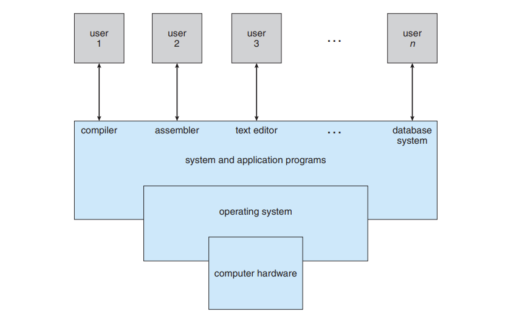

# 
1. Introduction

An operating system (OS) is software that manages computer hardware and software resources and provides common services for computer programs.

Fig: Abstract view of the components of a computer system.

